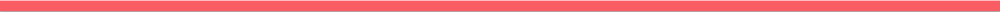
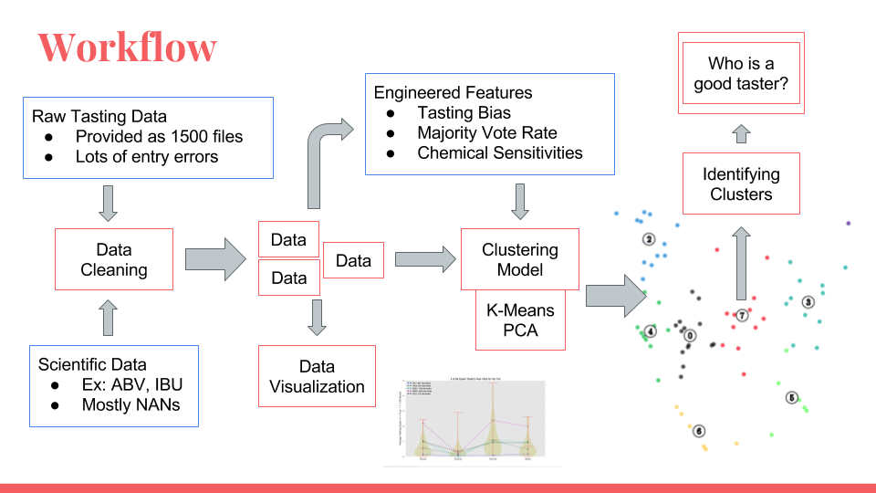
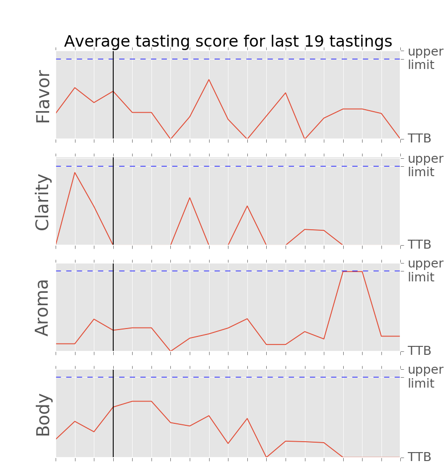
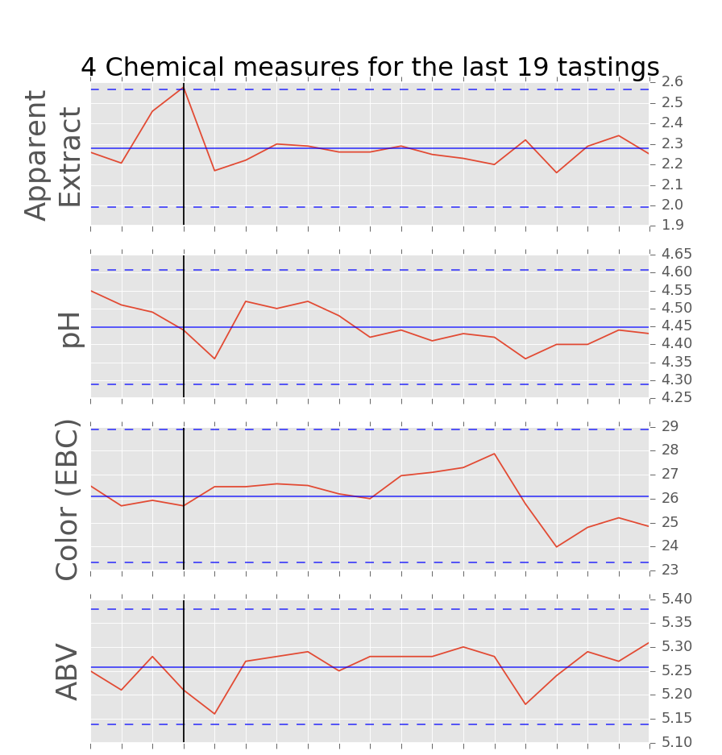

# Seeing Taste

### Visualization of Beer Tasting
#### Through the eyes of a Data Scientist

Having a consistent high quality tasting craft product is important but accurately tasting that product can be challenging. Using data science techniques for clustering, statistics, &amp; the powers of python, Seeing Taste uses unsupervised learning to cluster tasters and identify who's good, who has a bias, and who has a specialized pallet all for the sake of making great craft beer.

## Table of Contents
- [Workflow](#workflow)
- [The Data](#the-data)
- [Visualization](#visualization)
- [Engineered Features](#engineered-features)
- [Clustering](#clustering)
- [What Does it Mean?](#what-does-it-mean?)
- [Next Steps](#next-steps)
- [Contact](#contact)

## Workflow

#### Figure 1: The work flow from data acquisition to answering the research question: Who is a good taster?

## The Data

New Belgium has graciously provided tasting and scientific data for me to work with. Real world data can be messy and this was no exception. Using Pandas, Regular Expressions, and some smart while loops I was able to correct typos, fill in missing values, and extract id numbers from strings.

Figure 2, (below, left) shows the tasting data for the latest 19 tasting sessions. There are 4 main beer qualities that the tasters evaluate: flavor, clarity, aroma, and body. The red line shows the average taster score where a higher value indicates that more tasters thought that quality was Not True to Brand. On the right, are 4 scientific measurements for those same 19 sessions.

The vertical black line indicates one individual session where Apparent Extract peaks just outside the acceptable range (indicated by the dashed lines). Looking at the tasting data on the left some of our tasters may have noticed this based on those who flagged Not True to Brand on flavor.

#### Figure 2 & 3: raw tasting and chemical measurement data respectively

 

I limited my data to those tasters who were current on their New Belgium training and to tasting on their flagship beer, Fat Tire.

## Visualization

The first step was to create a data table to link each taster with each tasting session they participated in. This allows me to quickly and easily find all the data associated with any specific taster or tasting session.

From these connections, I started visualizing the distribution of the tasters to get a better idea of where differences occur. Below is a collection of violin plots show the distribution of average taster score for each of the four tasting qualities. 5 individual taters were plotted on top.

Amazingly, this one plot houses all of the actual tasting data and from it I was able to engineer features.

#### Figure 4: Violin Plots for Taster Distributions

## Engineered Features

Below are the four different types of features that were engineered.

- Tasting Bias
    - High value indicates they __often__ flag as Not True to Brand
    - Low value indicates they __rarely__ flag as Not True to Brand
- Majority Vote Rate
    - High value indicates they often flag as Not True to Brand when others agree
    - Rewards tasters who agree when the beer is Not True to Brand
- Chemical Sensitivity
    - Rewards tasters who flag a beer when a chemical measurement was outside of the acceptable range
    - High value indicates they often flag a beer when measure is out of normal range
    - Score of 0 indicates they have not experienced any such spikes
- Experience
    - Indicates how many Fat Tire tastings they participated in

## Clustering

## What Does it Mean?

## Next Steps

## Contact
