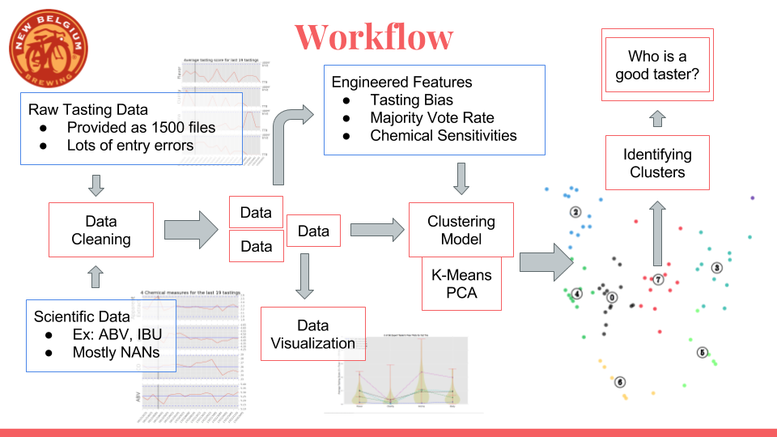

# Seeing Taste

### The Visualization of Beer Tasting through the eyes of a Data Scientist

For New Belgium, having a consistent high quality tasting craft beer product is important. The complex flavors consumers love can vary unexpectedly, and accurately tasting the product can be challenging.  Seeing Taste uses unsupervised learning to cluster tasting data to identify which taster is trustworthy, who has a bias, and who has a specialized pallet - all for the sake of making great craft beer.

## Table of Contents
- [Workflow](#workflow)
- [The Data](#the-data)
- [Visualization](#visualization)
- [Engineered Features](#engineered-features)
- [K-Means Clustering](#k-means-clustering)
- [What Does it Mean?](#what-does-it-mean?)
- [Business Insight](#business-insight)
- [About Jan](#about-jan)

## Workflow

#### Figure 1: The work flow from data acquisition to answering the research question: Who is a good taster?

## The Data

New Belgium has graciously provided tasting and scientific data for me to work with. Real world data can be messy and this was no exception. Using Pandas, Regular Expressions, and some well nested while loops I was able to correct typos, fill in missing values, and extract id numbers from strings.

Figure 2, (below, left) shows the tasting data for the latest 19 tasting sessions. Each taster There are 4 main beer qualities that the tasters evaluate: flavor, clarity, aroma, and body. The red line shows the average taster score where a higher value indicates that more tasters thought that quality was Not True to Brand. On the right, are 4 scientific measurements for those same 19 sessions.

The vertical black line indicates one individual session where Apparent Extract peaks just outside the acceptable range (indicated by the dashed lines). Looking at the tasting data on the left some of our tasters may have noticed this based on those who flagged Not True to Brand on flavor.

#### Figure 2 & 3: Raw tasting & sample chemical measurement data respectively

 

I limited my data to those tasters who were current on their New Belgium training and to tasting sessions involving their flagship beer, Fat Tire.

## Visualization

The first step was to create a data table to link each taster with each tasting session they participated in. This allows me to quickly and easily find all the data associated with any specific taster or tasting session.

From these connections, I started visualizing the distribution of the tasters to get a better idea of where differences occur. Below is a collection of violin plots show the distribution of average taster score for each of the four tasting qualities. 5 individual taters were plotted on top.

Amazingly, this one plot houses all of the actual tasting data and from it I was able to engineer features.

#### Figure 4: Violin Plots for Taster Distributions

## Engineering Features

Because the tasting data only consisted of ones, zeros, and NaNs engineering features proved very important.

- __Tasting Bias__
    - High value indicates tasters who __often__ flag as Not True to Brand
    - Low value indicates tasters who __rarely__ flag as Not True to Brand
- __Majority Vote Rate__
    - High value indicates tasters who often flag as Not True to Brand when others agree
- __Chemical Sensitivity__
    - Looking back at figure 2 & 3 some spikes in chemical measures can be linked to some tasters indicating Not True to Brand. This feature attempts to reward those who do
    - High value indicates tasters who often flag a beer when measure is out of normal range
    - Score of 0 indicates they have not experienced any such spikes
    - Negative value indicates a taster who has never flagged a beer as Not True to Brand when the chemical measure spikes
- __Experience__
    - Indicates how many Fat Tire tastings the tasters have participated in

## K-Means Clustering

I used K-Mean to cluster the tasters into groups. Simply put, K-Means using a distance metric to group tasters by how similar they are to each other. The algorithm takes all features into account creating clusters that would be challenging for a human to balance. K-Means requires input of the number of clusters as a hyper-parameter.

Below on the left in Figure 5, you can see the silhouette score of the clusters. This score compares the distance of each point to its own cluster center over the distance to the other clusters. Maximizing this over varying numbers of clusters showed 8 groups as the optimum value.

#### Figure 5: Silhouette score plot and 2-D PCA visualization

Plot created from code provided by [Scikit-Learn](http://scikit-learn.org/stable/auto_examples/cluster/plot_kmeans_silhouette_analysis.html#sphx-glr-auto-examples-cluster-plot-kmeans-silhouette-analysis-py)

Above on the right, shows a 2-dimensional visualization of the clusters by using Principle Component Analysis (PCA) to reduce the dimensions to two for plotting. Looking at the plot, the clusters nicely have separation with very little overlap when only plotting the first two dimensions.

Now that we have our clusters, what do they actually mean?

## What Does it Mean?

Now that we have our clusters, plotting the distributions for each feature, for each quality (Flavor, clarity, etc.), and for each cluster will provide insight into how we did.

Below in Figure 6 & 7, we can see an example of when the clustering created distinct and recognizable groups. The key here is to look at the trend of each distribution and find the ones that lean one way or the other. This indicates that in that cluster, that feature helps identify what type of tasters they are. Below are some examples printed with helpful arrows for the readers to easily follow along at home.

- __Trustworthy Tasters__
    - Have low bias --> tend to be more conservative with flagging as NOT TTB
    - Have high majority vote rate --> when they do flag NOT TTB others tend to as well
    - These tasters tend to have more experience and have participated in more tastings
- __New Taster__
    - Hasn't had time to develop a bias or experience a spike in chemical measures
    - When these tasters do flag NOT TTB others tend not to agree
    - Low experience

#### Figure 6: Identifying Trustworthy and New Tasters

- __Biased Tasters__
    - Have high bias --> tend to flag as NOT TTB more frequently than the others
    - Have low majority vote rate --> when they do flag as NOT TTB others don't tend to agree
- __Alcohol by Volume (ABV) Specialist__
    - These tasters have shown some ability to flag a beer as NOT TTB when the ABV spikes outside of the acceptable range

#### Figure 7: Identifying Biased and ABV Specialist Tasters

## Business Insight

- If there are too many new and/or biased tasters?
    - Retest ensuring a diverse tasting team
- Need a trustworthy taster immediately?
    - Identify who can be called in
- Does a spike in chemical measurements actually affect the taste?
    - Identify a specialist
- Identify tasters who may need more training  

Create profiles for each taster where they can brag about what they excel in with statistics like collectable baseball cards

## About Jan

Because of my background in the beer industry I was very exited to work with New Belgium on this project. A big thanks to Matt for providing the data.

Combining this with engineering and psychology may appear like a mix-matched bag, however, Data Science perfectly marries them all. How this all happen? Well...

During the summer of 2015 I had the exciting opportunity to travel and work at a craft brewery in South Africa. There I learned about the science and math behind brewing and because of my BS in Aerospace Engineering, I started to code a GUI to aid my beer making.

Though working in the beer industry was a blast, I found myself -- and this is crazy to say -- missing math. In my free time I studied python and statistics, This naturally led to me enrolling in Galvanize's Data Science program. The program has connected the statistical experimentation of my psychology BA with the rigorous math of my engineering experience into quite the marriage of my skills. My Galvanize capstone project working with the craft brewery New Belgium brought everything full circle.

I now proudly call myself a Data Scientist.

- [Linkedin](https://www.linkedin.com/in/janvanzeghbroeck/)
